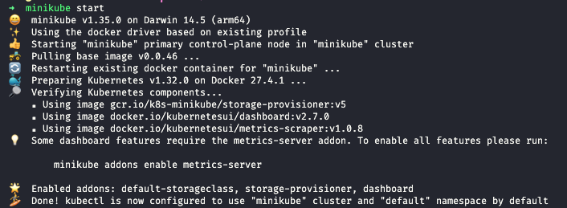
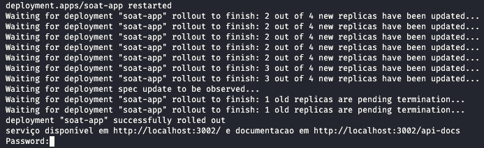
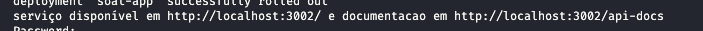
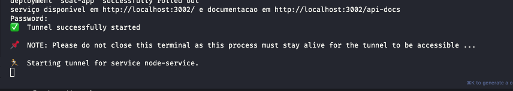

# POS Tech - FIAP SOAT10 - Fase 2 - Apresentação

## Entregável 2

**Turma:**

- Danilo S. | RM360100
- Douglas B. | RM360378
- Jaqueline M.P.S. | RM359838
- Skawinki | RM359870

---

## Configuração do projeto

1.  instalar [minikube](https://minikube.sigs.k8s.io/docs/start/?arch=/macos/arm64/stable/binary%20download) localmente;
2.  Iniciar minikube: 
3.  Rodar o comando 'k8s:run' - (_yarn k8s:run_ ou _npm run k8s:run_)
4.  o script irá dar um rollout nos pods, apenas por garantia e pode ser que também lhe peça um password, caso isso aconteça preencha com sua senha de administrador; 
5.  Note que o script lhe forneceu urls para requisições RestFull, assim como forneceu a URL para acesso da documentação no Swagger; 
6.  A aplicação esta pronta para uso;

OBS: **Note que o minikube trava o terminal para uso do tunel, caso cancele a operação o túnel e consequentemente o acesso externo será finalizado.**

OBS2: **Devido ao Rollout inicial do script a aplicação pode levar algum tempo para que o acesso externo seja liberado notificando que a url esta inalcançável, neste caso aguarde alguns segundos para que os pods estejam ativos.**
